## 一款神奇又好用的全局消息端到端加解密软件

<!-- PROJECT SHIELDS -->

 

  
  &nbsp;
  
  &nbsp;
  
  &nbsp;
  
  &nbsp;
  
  &nbsp;
  

  

<!-- PROJECT LOGO -->

  
  <h1 align="center">Neko Crypt</h1>
  

    <a href="https://github.com/rizxfrog/QQE2EE">查看Demo</a>
    ·
    <a href="https://github.com/rizxfrog/QQE2EE/issues">报告Bug</a>
    ·
    <a href="https://github.com/rizxfrog/QQE2EE/issues">提出新特性</a>
  

  
## 目录

- [QQE2EE](#projectname)
    - [目录](#目录)
        - [**使用教程**](#使用教程)
        - [**下载链接**](#下载链接)
        - [支持软件](#支持软件)
        - [版权说明](#版权说明)
        - [重要声明](#重要声明)

# 使用教程

## 1. 打开无障碍权限

    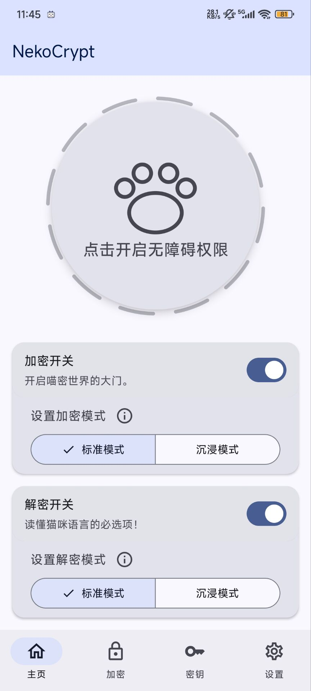

看到那个巨大猫爪了吗？点击它！会跳转到无障碍权限页面列表。

    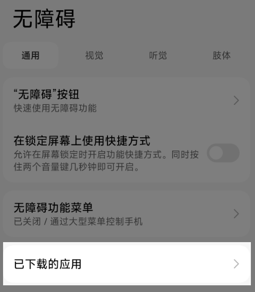

点击“已下载的应用”

    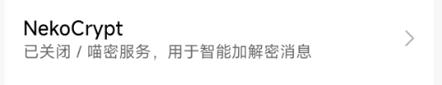

    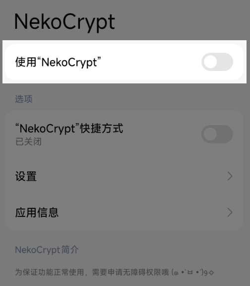

开启后，返回主界面，看到猫爪变为深色就大功告成啦！

    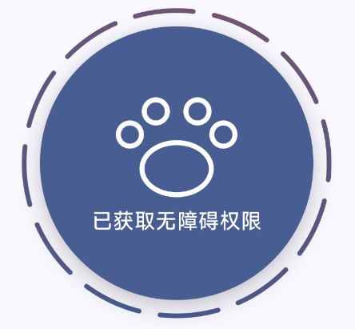

## 2. 使用过程

#### 下面以QQ为例

### 进入群聊，可以看到输入框的发送按钮有浅蓝色遮罩

    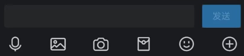

#### 看到有遮罩即为功能正常，如果想关闭遮罩，可以在设置中选择遮罩颜色，默认配色板的最后一个即为纯透明。

  

| QQE2EE |    标准模式    |    沉浸模式    |
|:---------:|:----------:|:----------:|
|   加密模式    | 长按发送按钮发送密文 | 点击发送直接发出密文 |
|   解密模式    | 点击含密文消息解密  | 自动解密，耗电增加  |

  

#### 解密效果展示如下：

    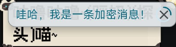

 

### 双击输入框，拉起附件发送界面

    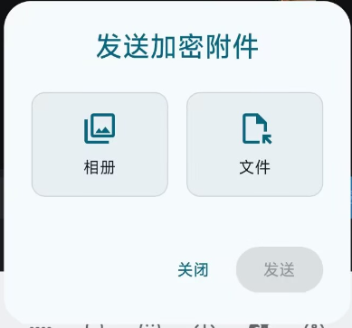

 

#### 让我们来发送一个小约翰吧！

    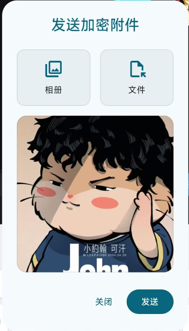

 

条件限制，目前只支持10M以内的图片、文件发送，将来会扩展。

### 适配额外聊天软件

设置页面，可以打开扫描开关

    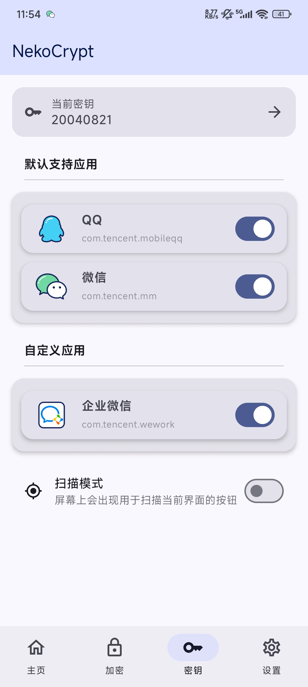

 

切到你想要适配的聊天软件，确保界面上显示了发送按钮(有的软件只有输入框有字才会显示发送按钮)，点击猫爪悬浮窗自动扫描。

    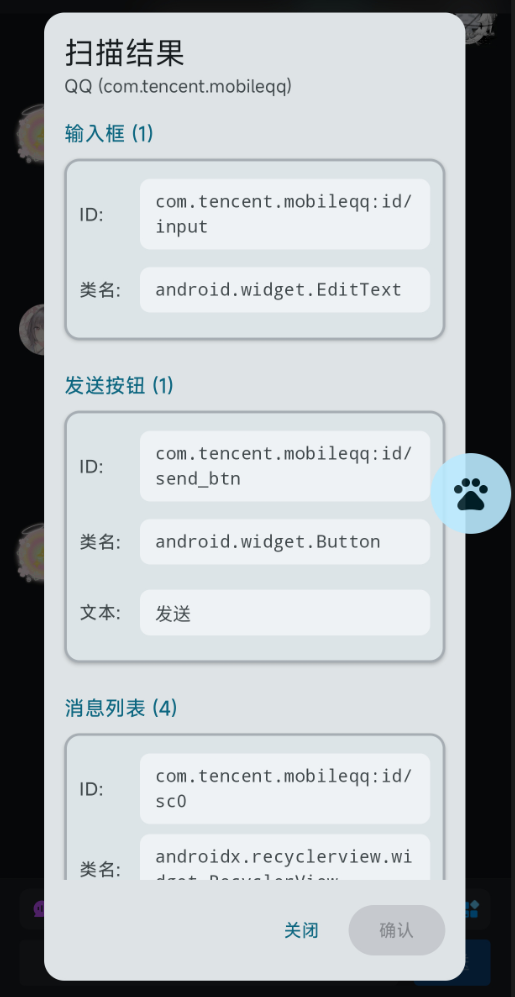

 

必须选择四个要素：输入框、发送按钮、消息列表、消息节点后，才可以点击确认。确认后自动保存配置，就可以使用了。这里特别要注意的是，选择消息节点时必须注意内容是你发送的文本，不要误选成昵称、群等级之类的错误节点。

## 下载链接
#### 右侧release内也可下载

## 支持软件
 

|   QQE2EE   | 是否支持 |     备注     |
| :---:        |    :----:   |:----------:|
| QQ      |✅      |    完全支持    |
| 微信   |     ✅    |    完全支持    |
| 更多   |    ✅      | 使用扫描功能自助添加 |

 

## 版权说明
该项目签署了EPL-2.0 license
授权许可，详情请参阅 [LICENSE](https://github.com/rizxfrog/QQE2EE/blob/main/LICENSE)****

## 重要声明
### 本项目仅供交流学习使用，**禁止**用于一切非法用途！任何问题概不负责。(｡•́︿•̀｡)

## 📝 To Do List

- [x] **完全支持微信**

- [x] **支持更换密钥**

- [x] **支持端到端加密**

- [ ] **支持更大文件的发送**

- [ ] **支持修改主题色**

- [ ] **支持更多加密语种**

- [ ] **支持时间轮转密钥，使得加密消息有时间限制，无法查看之前时间段的加密内容**

## 如果您喜欢本项目，请给我点个⭐吧(๑>◡<๑)！

## ⭐ Star 历史

<!-- links -->

[your-project-path]:rizxfrog/QQE2EE

[contributors-shield]: https://img.shields.io/github/contributors/rizxfrog/QQE2EE.svg?style=flat-square

[contributors-url]: https://github.com/rizxfrog/QQE2EE/graphs/contributors

[forks-shield]: https://img.shields.io/github/forks/rizxfrog/QQE2EE.svg?style=flat-square

[forks-url]: https://github.com/rizxfrog/QQE2EE/network/members

[stars-shield]: https://img.shields.io/github/stars/rizxfrog/QQE2EE.svg?style=flat-square

[stars-url]: https://github.com/rizxfrog/QQE2EE/stargazers

[issues-shield]: https://img.shields.io/github/issues/rizxfrog/QQE2EE.svg?style=flat-square

[issues-url]: https://img.shields.io/github/issues/rizxfrog/QQE2EE.svg

[license-shield]: https://img.shields.io/github/license/rizxfrog/QQE2EE.svg?style=flat-square

[license-url]: https://github.com/rizxfrog/QQE2EE/blob/main/LICENSE

[linkedin-shield]: https://img.shields.io/badge/-LinkedIn-black.svg?style=flat-square&logo=linkedin&colorB=555

[linkedin-url]: https://linkedin.com/in/shaojintian

[oldQQ-download-link]:https://dldir1.qq.com/qqfile/qq/QQNT/448e164c/QQ9.9.15.26909_x64.exe

[LL-installer-link]:https://ats-prod.oss-accelerate.aliyuncs.com/18734247705198dcb594916e8ba1facc

[//]: # (不知道写点啥)
